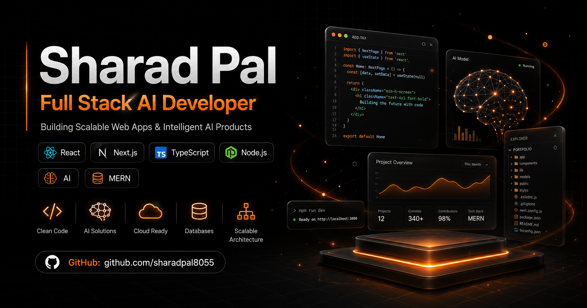

# Sharad Pal — Developer Portfolio

A modern, high-performance developer portfolio built to showcase my software engineering journey, full-stack projects, AI applications, achievements, and technical experience.

Designed with a premium UI experience, smooth animations, SEO optimization, and production-ready architecture.

---

## 🌐 Live Portfolio

🔗 Website:  
https://sharadpal-portfolio-eta.vercel.app

---

## 📸 Preview



---

## ✨ Features

### 🎨 Modern User Interface
- Premium dark theme design
- Glassmorphism UI components
- Smooth animations
- Responsive layouts
- Mobile-first experience

### 👨‍💻 Developer Profile
- Professional introduction
- Technical skills showcase
- Experience timeline
- Education journey
- Core CS fundamentals

### 🚀 Project Showcase
- Featured project highlights
- Live demo links
- GitHub repository links
- Technology stack badges
- Interactive project cards

Featured projects include:

- 🤖 Clutch AI — AI Productivity Platform
- 🛒 Zenthrixa — MERN E-Commerce Platform
- 🎓 E-Learning Platform
- ✅ Task Manager MERN App
- 🌱 FloraVision
- 🧠 CodeNova AI Object Recognition
- 🌍 SafeSphere Disaster Prediction AI

### 🏆 Achievements Section
- Academic achievements
- Hackathon results
- Open-source contributions
- Certifications showcase

Includes:

- 🏅 ET AI Hackathon Semi-Finalist
- 🚀 Vibe2Ship Top 10 Finalist — Clutch AI
- 🌍 Open Source Connect Global 2026 Contributor
- 💻 200+ DSA Problems Solved
- 🎯 TechSprint Manipur AI Hackathon
- 📚 GeeksforGeeks Technical Workshop

### 📩 Contact System
Production-ready contact backend:

User Message

        ↓

Next.js API Route

        ↓

Resend Email API

        ↓

Gmail Inbox


Features:

- Form validation
- Server API handling
- Loading states
- Email delivery system


---

# 🛠️ Tech Stack


## Frontend


## Animation & UI


## Backend


## Deployment


---

# 📂 Project Structure


```bash
portfolio
│
├── public
│   ├── projects
│   ├── resume.pdf
│   └── og-image.png
│
├── src
│
│── app
│   ├── api/contact
│   ├── layout.tsx
│   └── page.tsx
│
│── components
│
│   ├── navbar
│   ├── hero
│   ├── about
│   ├── skills
│   ├── experience
│   ├── projects
│   ├── achievements
│   ├── contact
│   └── footer
│
│── constants
│
│── lib
│
└── README.md
```

---

# ⚡ Performance Optimizations


Implemented:

- Next.js App Router
- Static page generation
- Image optimization
- SEO metadata
- OpenGraph preview
- Sitemap generation
- Robots.txt
- Lazy loading
- Optimized components


---

# 🔍 SEO Features


Included:

- Metadata optimization
- OpenGraph image
- Social media preview cards
- Sitemap.xml
- Robots.txt
- Manifest file


---

# 🚀 Installation & Setup


Clone repository:


```bash
git clone https://github.com/sharadpal8055/sharadpal-portfolio
```

Move into project:


```bash
cd portfolio
```

Install dependencies:


```bash
npm install
```

Create environment file:


```bash
.env.local
```


Add:


```env
RESEND_API_KEY=your_resend_key

CONTACT_EMAIL=sharadpal409@gmail.com

NEXT_PUBLIC_SITE_URL=https://sharadpal-portfolio-eta.vercel.app
```


Run development server:


```bash
npm run dev
```


Build production:


```bash
npm run build
```


Start production:


```bash
npm start
```


---

# 📊 Deployment


Application deployed using Vercel.


Build:


```bash
npm run build
```


Output:


```bash
Next.js optimized production build
```


---

# 👨‍💻 Author


## Sharad Pal


Computer Science Engineering Undergraduate  
Full Stack Developer | AI Enthusiast


### Connect:


GitHub:  
https://github.com/sharadpal8055


LinkedIn:  https://www.linkedin.com/in/sharadpal8055/


Portfolio:  
https://vercel.com/sharad-pals-projects


---

# ⭐ Support


If you like this project, consider giving it a ⭐ on GitHub.

---

### Building scalable applications and intelligent software solutions 🚀
